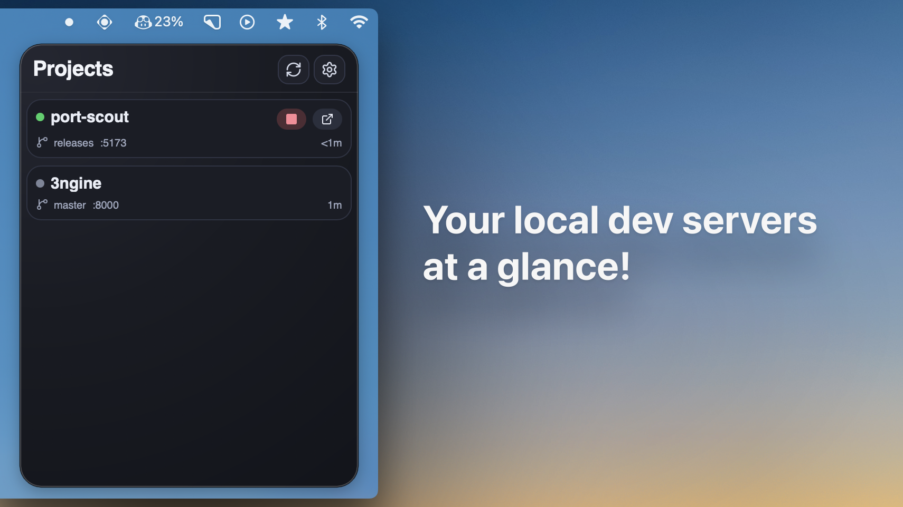

# Port Scout

Port Scout is a lightweight menu bar app for macOS that helps you keep track of all your local development servers in one place. Instead of remembering which project runs on which port, you can quickly see each project’s status, open it in your browser, and stop the processes without touching the terminal. It is designed to stay out of your way while giving you instant visibility into what is running and where.


## Features

- Monitor all your local projects and ports from the menu bar.
- Choose discovery folders and automatically find active projects inside them, including subfolders.
- Review a detected project with **Track**, then save its name, port, and start command.
- See at a glance whether each project is running or stopped.
- Open any project instantly in your browser (localhost:<port>).
- View useful context like git branch, active process, and last running time.
- Stop a running port safely from the app.
- Keep your list organized with editable projects and quick refresh.
- Optional start at login so Port Scout is always ready when you start coding.

## Development

```bash
npm install
npm run tauri:dev
```

The frontend runs on `http://localhost:5173` and Tauri launches against that dev URL.

## Build

```bash
npm run tauri:build
```

Artifacts are emitted under `src-tauri/target/release/bundle`.

For a local `.app` build without generating signed updater artifacts:

```bash
npm run tauri:build -- --bundles app --config '{"bundle":{"createUpdaterArtifacts":false}}'
```

## Menu bar and displays

Left-click the menu bar icon to toggle the popover. The context menu also provides
**Show Port Scout** as an explicit way to open it. Opening the app again from
Finder restores the popover; launch-at-login stays minimized.

The popover uses the selected display's logical coordinates and visible work area
so it keeps the same interface size between Retina and external displays.

## Automatic discovery

Add your project folders in **Settings → Discovery folders → Add folder**.
Discovery starts once at least one folder is configured. The list is saved
between launches; removing a folder stops discovery there without deleting any
tracked projects.

**Detected on this Mac** refreshes every five seconds alongside saved projects.
Port Scout inspects TCP listeners and their process working directories locally;
it does not probe services or run project commands during discovery. Only
recognized projects inside your selected folders appear. Active discoveries
have a green status light, and newly detected servers appear first. Projects
can be reviewed and saved with **Track**. A saved project running on a
different port still appears as a discovery so its actual port is visible.
Use **Update port** to review and save that change on the existing project.

System processes, unidentified listeners, and projects outside the selected
folders are omitted. Folder boundaries use resolved paths: a symlink to a project
outside a selected folder does not expand discovery to that other location.

## Testing

Frontend:

```bash
npm run typecheck
npm run build
```

Rust (from `src-tauri`):

```bash
cargo fmt --all
cargo test
```
